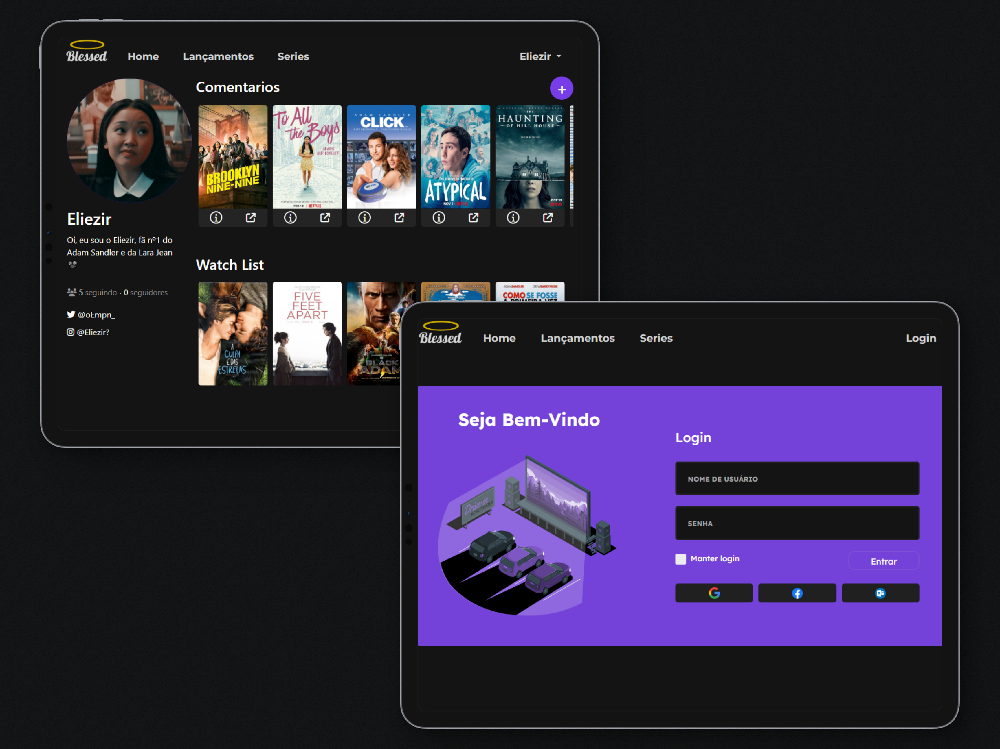

  
&nbsp;

Welcome to Cinema Blessed, the go-to website for movie and series enthusiasts! 🎬🍿

## 😀 Introduction

Cinema Blessed is a dynamic web platform built with Express.js, EJS, Bootstrap, and MongoDB, designed to provide an immersive experience for movie and series lovers. Our mission is to curate expert reviews while fostering a vibrant community where users can share their thoughts, connect with friends, and receive personalized recommendations based on their compatibility with others.

## 🗝 Key Features

- **Expert Reviews:** Our website boasts a dedicated team of movie experts who provide insightful and unbiased reviews for the latest films and series. Stay updated with the best recommendations before your next binge-watching session.

- **User Reviews:** Cinema Blessed believes in the power of community. Share your own reviews and ratings for movies and series you've watched. Help others discover hidden gems and make informed choices.

- **Friends and Recommendations:** Connect with friends on the platform and discover shared interests. If you and your friends have similar tastes in movies, our algorithm will generate personalized recommendations based on your compatibility.

- **Interactive Interface:** The user-friendly interface, crafted with Bootstrap, ensures seamless navigation and an enjoyable experience while exploring movie details, reviews, and personalized recommendations.

## 🖥 Technologies Used

Cinema Blessed is powered by a robust tech stack, including:

- Express.js: A versatile Node.js framework that facilitates efficient server-side development and API handling.

- EJS: A template engine for Node.js that allows us to create dynamic and reusable HTML templates.

- Bootstrap: A front-end framework that enhances the website's responsiveness and visual appeal, making it accessible across various devices.

- MongoDB: A flexible and scalable NoSQL database, ensuring efficient storage and retrieval of movie and user data.

Made with 💜 by <a href="https://github.com/Eliezir">Eliezir Neto</a> 
